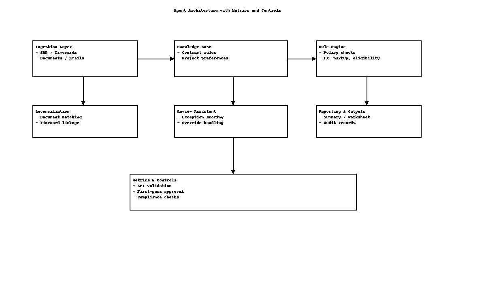
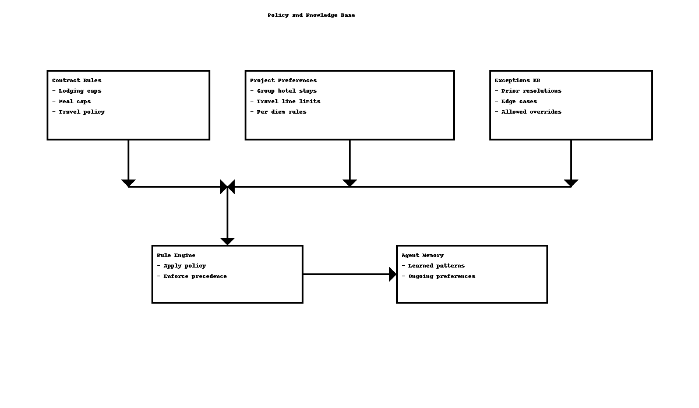

# Agentic Billing Review Solution Design

## Overview

This document describes a Python-based agentic AI solution for Meridian Atlas Partners reimbursement validation. The solution is designed to automate reimbursement submission review, receipt reconciliation, contract-rule enforcement, backup document validation, and analyst exception triage.

The goal is to minimize manual review by capturing policy, edge-case knowledge, and historical resolutions in a structured knowledge base.
The agent is triggered by employee reimbursement request submission, not by month-end invoice generation.

## Goals

- Kick off review on employee reimbursement submission
- Ingest and normalize reimbursement, timecard, document, contract, and email inputs
- Apply deterministic contract rules and project-specific preferences
- Reconcile reimbursement requests against backup documents
- Detect exceptions and ambiguous items for analyst review
- Preserve process reinvention and reduce manual review overhead
- Maintain an evolving knowledge base for edge cases and prior decisions
- Produce analyst-ready summaries, exception reports, and audit trails
- Deliver measurable KPI outputs for cycle time, exceptions, accuracy, and compliance

## High-Level Architecture

### Components

1. **Submission Trigger Handler**
   - Receives employee reimbursement requests as the primary trigger event
   - Starts the reimbursement review workflow immediately instead of waiting for month-end

2. **Ingestion Layer**
   - Fetches SAP expense and timecard extracts via RFC/BAPI
   - Loads receipts and backup documents from SharePoint through MS Graph
   - Ingests PL instructions and email guidance from Teams/Email channels
   - Normalizes currency, date, vendor, and employee identifiers

3. **Billing Supervisor Agent**
   - Orchestrates the reimbursement review workflow
   - Maintains transaction state across resubmissions and hold status
   - Sequences child agents and routes results to the right downstream handler

4. **Document Extraction Module**
   - Parses uploaded receipt documents and form data
   - Extracts receipt totals, vendor details, dates, and line items
   - Handles composite scans, unreadable documents, and missing backup cases

5. **Match and Validate Engine**
   - Reconciles reimbursement requests against the submitted receipt evidence
   - Uses AI-assisted matching to pair receipts with SAP lines
   - Applies contract rules, project preferences, and prior exception precedent

6. **Exception and Instruction Triage**
   - Captures PL guidance and disambiguates override intent
   - Looks up decision memory for known patterns
   - Flags novel exceptions and routes them to analysts

7. **Notification and Packaging**
   - Generates employee approval or correction messages
   - Sends analyst escalation summaries for ambiguous or blocked cases
   - Logs transaction state and decision rationale for future reference
> Core MVP: reimbursement submission validation and analyst exception triage. Downstream draft-invoice hold, safe SAP write, and invoice release flows are acknowledged as future extension points for later integration.
## Data Model

### Primary entities
- Transaction
- Expense
- TimecardEntry
- ReceiptDocument
- ContractClause
- ProjectInstruction
- ExceptionCase

### Key attributes
- transaction_id, employee_id, project_id, task_code, category, amount, currency, hold_flag
- receipt_id, document_type, date, total_amount, currency, raw_ocr, extracted_tags
- clause_id, category, rule_type, threshold, policy_text, applied_scope
- instruction_id, source, date, intent, override_type, effective_scope

## Knowledge Base Design

### Why a knowledge base matters

- Prevents repeated manual review of previously resolved patterns
- Encodes edge cases as reusable policy facts
- Supports project-specific preference memory
- Enables the agent to reason about precedence and overrides

### Knowledge base structure

- `contract_rules/`
  - lodging_cap.json
  - meal_cap.json
  - travel_rate.json
  - subcontractor_markup.json
  - non_reimbursable_items.json

- `project_preferences/`
  - group_hotel_stays: true
  - travel_lines_per_trip: 2
  - per_diem_allowed_for_site_visits: true
  - lounge_access_allowed: false

- `historical_exceptions/`
  - previous_resolution_001.json
  - previous_resolution_002.json

## Workflow

### End-to-end flow

1. **Trigger on employee reimbursement submission**
   - The review starts when an employee submits a reimbursement request with attached receipt or backup reference.
   - The agent loads the submission and begins validation immediately.

2. **Load inputs**
   - `unbilled-2026-04.csv` or the equivalent reimbursement entry
   - `timecards-2026-04.csv`
   - Backup documents in `appendix-sample-data/documents/`
   - `contract-001.md`
   - `sample-emails.md`

3. **Normalize and link**
   - Resolve backup references to transactions
   - Normalize employee IDs and project IDs
   - Convert foreign currency lines

4. **Apply rules**
   - Enforce lodging, meal, alcohol, per diem, mileage, and subcontractor policies
   - Flag hold items and compare with PL instruction overrides

5. **Reconcile differences**
   - Detect receipt amount mismatches and unsupported charges
   - Identify missing document attachments
   - Identify timecard gaps and mis-codings

6. **Decide and notify**
   - Approve clean submissions
   - Request employee corrections for receipt issues or policy gaps
   - Escalate complex cases to an analyst

7. **Create recommendations**
   - Approve as submitted
   - Recommend corrections or adjustments
   - Mark submissions on hold when backup is missing or policy is violated
   - Escalate novel or ambiguous cases for analyst review

8. **Persist knowledge**
   - Save new edge-case resolution to the project KB
   - Update preference memory for the project

## Success criteria and KPI alignment

This design is built around measurable success targets. The prototype is intended not only to automate review tasks but to improve performance against the key business metrics that matter for reimbursement validation.

- 50% fewer analyst hours per reimbursement review
- 25% shorter submission validation cycle time
- 55%+ exceptions resolved without Project Lead involvement
- 90%+ first-pass validation accuracy
- Zero critical compliance failures

These metrics drive the workflow design, the control points, and the reporting outputs.

## Edge-case Handling

### Example cases from sample data
- `RC-012-hotel-overcap.md`: amenable to override if documented in PL instruction
- `RC-013-client-dinner.md`: bill despite meal cap if PL authorizes working dinner
- `RC-014-airport-lounge.md`: drop per PL instruction
- `RC-017-personal-laundry.md`: exclude personal expenses regardless of backup match
- `VI-001-workshop-vendor.md`: reconcile SAP totals with vendor invoice and surface missing AV line
- `VI-002-subcontractor.md`: apply 8% markup on subcontractor pass-through
- `RC-016-composite.md`: validate composite receipt amount and classify as one expense line despite multiple receipts
- `RC-019-mismatched.md`: flag document with no matching transaction as orphaned
- `RC-018-unreadable.md`: present as unresolved document needing analyst clarification

### Rule precedence
1. Contract rule
2. Project-specific preference
3. Project Lead override / instruction
4. Historical exception precedent

## Evaluation alignment

The solution is structured to meet the operating metrics that matter most for a scalable reimbursement validation process.

- **Problem framing and high-value focus** — the agent targets the most effort-heavy, exception-prone part of employee expense submission.
- **Process reinvention** — the design captures policy and project knowledge, reduces manual handoffs, and builds a repeatable validation workflow.
- **Prototype evidence** — the plan delivers a working Python implementation on sample reimbursement data with employee-ready output.
- **Business impact** — the design focuses on measurable improvements in cycle time, accuracy, quality, and exception handling.
- **Operational readiness** — the architecture includes ingestion, reconciliation controls, audit trails, KPI validation, and notification support.
- **Scale-up clarity** — the design is built to work across projects with reusable policy and decision memory.

## Agent Behavior

### Agent goals
- Be an assistant, not a replacement
- Surface only items that require judgment
- Document why each decision was made
- Learn from resolved exceptions

### Suggested agent modes
- `review_mode`: full cycle reimbursement validation and report generation
- `audit_mode`: compare a reimbursement submission to previous cycle behavior
- `teach_mode`: ingest new PL email instructions and update preference memory

## Implementation Plan

1. Create Python package skeleton
2. Build ingestion and normalization modules
3. Define schema and `pydantic` models
4. Implement rule engine and KB loader
5. Implement reconciler and exception reporter
6. Implement project preference memory update
7. Create summary report templates
8. Add diagram assets and design documentation
9. Validate with sample data end-to-end

## Next enhancements and TODOs

- Implement upstream reimbursement submission ingestion and event trigger
- Add employee notification emails for approvals and correction requests
- Add analyst notification workflow for escalations and PL overrides
- Build sample data for submission-stage review scenarios
- Extend the rule engine for immediate receipt-level validation
- Add feedback loop to persist employee correction outcomes into the knowledge base
- Update the workflow diagram to reflect the new upstream trigger and reviewer notifications
- Validate the solution with submission-triggered reimbursement review and keep invoice release as future scope

## Appendix

- `design/diagrams/agent_architecture.png`
- `design/diagrams/policy_kb.png`
- `design/diagrams/review_workflow.png`

---

*Generated design document for the agentic billing review solution.*
