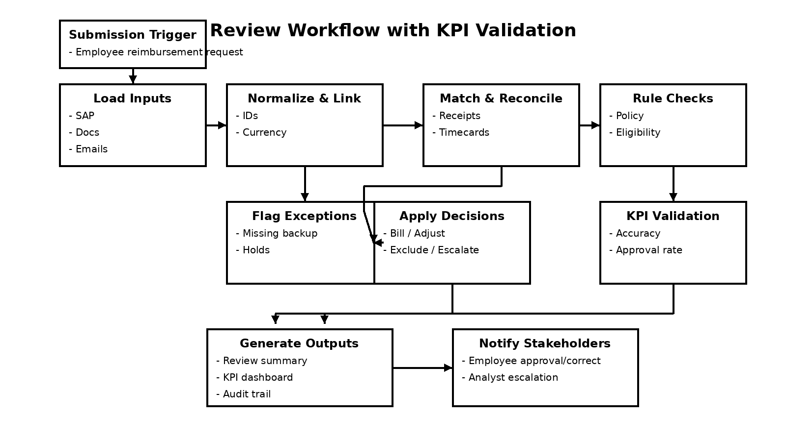

# Existing Billing Review Process

## Process diagram

- Generated from `design/diagrams/generate_review_workflow.py`
- Output: `design/diagrams/review_workflow.png`

## Planned agentic submission-triggered review

The future process shifts review upstream to reimbursement request submission. When an employee submits a request with receipts, the agent immediately validates it, reconciles supporting documents, and either approves the submission or requests correction. Complex or unclear cases are escalated to an analyst, reducing end-of-cycle reconciliation rework that currently dominates the process.

## Process steps
1. Load inputs
   - SAP outputs, unbilled transactions, backup documents, contracts, and instruction emails.
2. Normalize and link
   - Reconcile IDs, currency, and backup references across multiple sources.
3. Apply rules
   - Enforce policy checks, eligibility rules, and override guidance.
4. Reconcile differences
   - Detect under/over statements, missing attachments, and timecard mismatches.
5. Create recommendations
   - Determine bill, adjust, exclude, or escalate items.
6. Persist knowledge
   - Save edge-case resolutions and project preferences for future cycles.

## Pain points in the existing process
- Data fragmentation
  - Inputs are spread across CSVs, markdown documents, email notes, and contract text.
  - Manual consolidation increases effort and error risk.

- Manual matching and normalization
  - Cross-referencing receipts, timecards, and SAP transactions is time-consuming.
  - Currency conversion and ID normalization are prone to inconsistent treatment.

- Inconsistent rule enforcement
  - Policy checks depend on analyst memory or ad hoc spreadsheets.
  - Project Lead overrides and historical exceptions are hard to capture consistently.

- Exception overload
  - High volume of flagged items creates analysis bottlenecks.
  - Items requiring judgment are mixed with routine exceptions, slowing throughput.

- Poor audit trail and traceability
  - Decision rationale is often not documented clearly for each line item.
  - Compliance and reviewability suffer when analysts rely on undocumented judgments.

- Slow cycle time
  - Multiple handoffs between ingestion, review, and approval extend reimbursement validation.
  - Lack of automation means repeated rework for similar cases.

- Knowledge loss
  - Project-specific preferences and edge-case decisions are not captured systematically.
  - Analysts frequently re-evaluate recurring exceptions rather than reuse prior resolutions.
